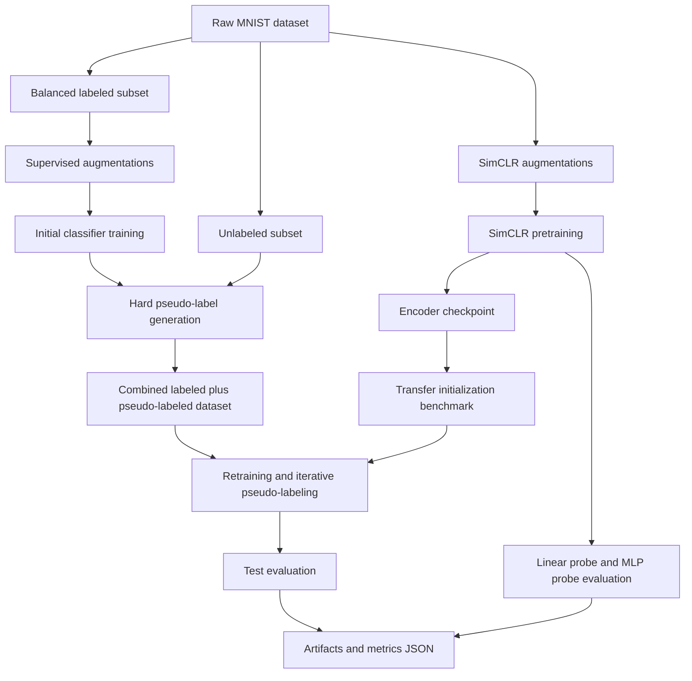

# SimCLR Hard Pseudo-Labeling

This project studies label-efficient image learning on MNIST by combining:

- SimCLR-style self-supervised representation learning
- linear probing and frozen-encoder MLP evaluation
- semi-supervised CNN training with hard pseudo-labeling
- iterative pseudo-label expansion under confidence thresholds

The codebase is organized as a reproducible Python project with YAML configs, CLI entry points, tests, and CI.

Reference paper: https://arxiv.org/abs/2002.05709

## Core Ideas

### What is SimCLR?

SimCLR is a self-supervised learning method. Instead of training with labels like `0`, `1`, or `2`, it teaches a model to recognize that two different augmented versions of the same image still come from the same source image.

In simple terms:

- take one image
- create two different augmented views of it
- train the model to keep those two views close in feature space
- push views from different images farther apart

The goal is to learn a useful representation before doing classification.

### What is linear probing?

Linear probing is a simple way to test whether the learned representation is good.

- freeze the encoder
- put a very small classifier on top
- train only that classifier

If a simple linear layer works well, it usually means the encoder learned features that separate classes clearly.

### What is pseudo-labeling?

Pseudo-labeling is a semi-supervised learning method.

- start with a small labeled dataset
- train a model on it
- run the model on unlabeled images
- keep only predictions the model is very confident about
- treat those predictions like temporary labels
- retrain using both real labels and pseudo-labels

This is useful when labeling data is expensive but unlabeled data is easy to get.

### What does hard pseudo-labeling mean?

Hard pseudo-labeling means the model picks one class as the label, such as `7`, instead of keeping the full probability distribution.

Example:

- soft label: `[0.01, 0.02, 0.93, ...]`
- hard label: `2`

This project uses confidence thresholds so only high-confidence hard labels are added.

## Original Results

These were the initial project results.

### SimCLR pretraining

| Evaluation head | Test accuracy |
|---|---:|
| Linear probe | 98.55% |
| Frozen-encoder MLP | 98.44% |

### Semi-supervised CNN

| Setup | Test accuracy |
|---|---:|
| CNN + augmentation | 93.66% |
| CNN + augmentation + hard pseudo-labeling | 94.12% |
| Iterative pseudo-labeling | 97.18% |

## Repo Layout

```text
.
├── configs/                  # experiment configs
├── docs/                     # roadmap and project notes
├── archive/                  # archived notebooks
├── src/simclr_hpl/           # reusable package code
├── tests/                    # smoke tests
├── archive/SimCLR.ipynb      # archived experiment notebook
├── archive/CNN_semi_supervised.ipynb
└── pyproject.toml            # uv-compatible project metadata
```

## Workflow Diagram



## Current Workflow

The project now supports three main experiment paths:

1. `simclr-train`
   Learn image representations without labels, then evaluate them with a linear probe and an MLP probe.
2. `pseudo-label-train`
   Train with a small labeled set, generate confident pseudo-labels on unlabeled data, and retrain.
3. `transfer-benchmark`
   Compare random initialization vs SimCLR initialization at multiple label budgets.

In short, the workflow is:

1. learn features with SimCLR
2. test how useful those features are
3. train a low-label classifier
4. add confident pseudo-labels from unlabeled images
5. compare whether SimCLR initialization helps the low-label pipeline

## Professional Setup With `uv`

### 1. Install and pin Python

```bash
uv python install 3.11
uv python pin 3.11
```

### 2. Create the environment and install dependencies

```bash
uv sync --dev
```

### 3. Run tests and lint checks

```bash
uv run pytest
uv run ruff check .
```

Optional shortcuts are available through [Makefile](/Users/macbookpro/Desktop/git/SimCLR-HardPseudoLabeling/Makefile), for example `make test`, `make benchmark`, and `make plots`.

### 4. Run the experiments

```bash
uv run simclr-train --config configs/simclr_mnist.yaml
uv run pseudo-label-train --config configs/pseudo_label_mnist.yaml
uv run transfer-benchmark --config configs/transfer_pseudo_label_mnist.yaml
```

Artifacts and metrics are written under `artifacts/`.

### 5. Generate plots from saved metrics

```bash
uv run plot-results --metrics artifacts/simclr_mnist/metrics.json
uv run plot-results --metrics artifacts/pseudo_label_mnist/metrics.json
uv run plot-results --metrics artifacts/transfer_benchmark_mnist/transfer_benchmark_metrics.json
```

By default, plots are written to a sibling `plots/` directory next to the metrics file.

## SimCLR Transfer Into Pseudo-Labeling

This benchmark compares:

- random initialization
- SimCLR-pretrained initialization

across balanced label budgets of:

- 100 labels
- 250 labels
- 500 labels

The benchmark uses the same `EncoderClassifier` architecture for both conditions, so the comparison is about representation initialization rather than model size.

```bash
uv run transfer-benchmark --config configs/transfer_pseudo_label_mnist.yaml
```

If `artifacts/simclr_mnist/simclr_encoder.pt` does not exist yet, the benchmark can pretrain a SimCLR encoder automatically and reuse it for the comparison.

Why this matters:

- random initialization starts from scratch
- SimCLR initialization starts with features learned from unlabeled data

That makes it easier to measure whether self-supervised pretraining improves sample efficiency when labels are limited.

## Project Structure

- experiment logic lives in `src/simclr_hpl/`
- experiments are config-driven through YAML files
- `uv` is now the expected environment workflow
- tests and GitHub Actions CI were added
- archived notebooks are kept under `archive/`

## Why This Is A Better Portfolio Project Now

- It shows both research experimentation and engineering discipline.
- It is reproducible enough for reviewers to run locally.
- It gives you a clear story around self-supervision, pseudo-label confidence thresholds, and working under extreme label scarcity.

## Visualization

Visualization is worth investing in here. For a portfolio project, good figures make the difference between "interesting code" and "clear ML story."

The strongest visualizations for this repo are:

- a label-budget comparison plot: `100 vs 250 vs 500` labels for `random` and `simclr` initialization
- a training-curve plot: train and validation accuracy or loss over epochs
- a pseudo-label growth plot: how many confident pseudo-labels are added per iteration
- a confidence-threshold plot: threshold vs pseudo-label count vs final accuracy
- a feature-space plot: t-SNE or UMAP of encoder features before and after transfer

My take: t-SNE can look nice, but it should not be the main evidence. For hiring and project credibility, the most important figures are the benchmark comparison plots and pseudo-labeling dynamics. Those show decision-making, not just pretty embeddings.

If we keep extending this repo, I’d recommend adding a small plotting module that reads `artifacts/*/metrics.json` and automatically generates publication-style figures into `artifacts/plots/`.

That plotting workflow is now built in through `plot-results`.

## Strong Portfolio Angle

This project now lets you show a stronger story than a single experiment run:

- you designed low-label learning experiments
- you refactored them into a reproducible Python project
- you benchmarked representation transfer from self-supervised pretraining into semi-supervised training

That is much closer to how modern ML engineering work is presented.

More ideas are in [docs/portfolio_roadmap.md](/Users/macbookpro/Desktop/git/SimCLR-HardPseudoLabeling/docs/portfolio_roadmap.md).
